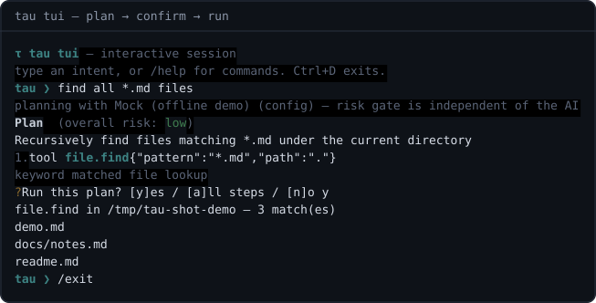
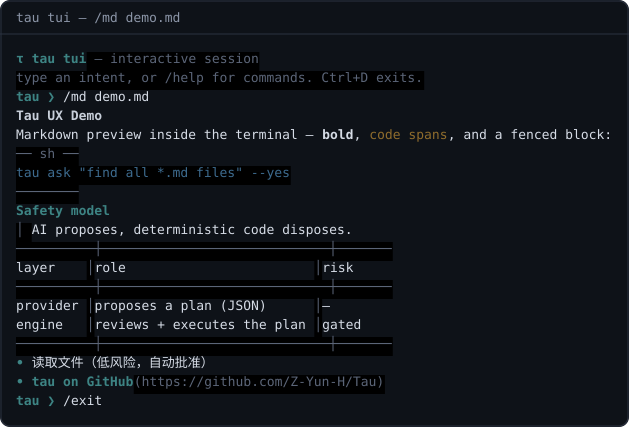
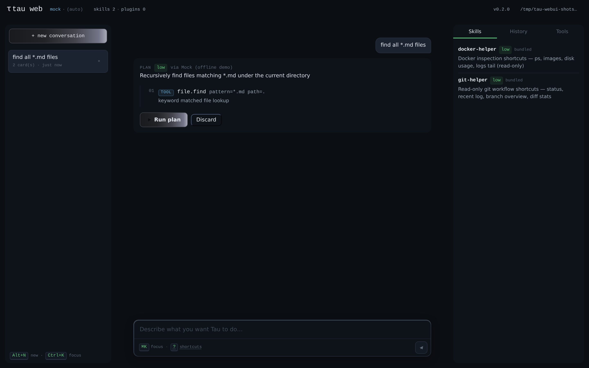
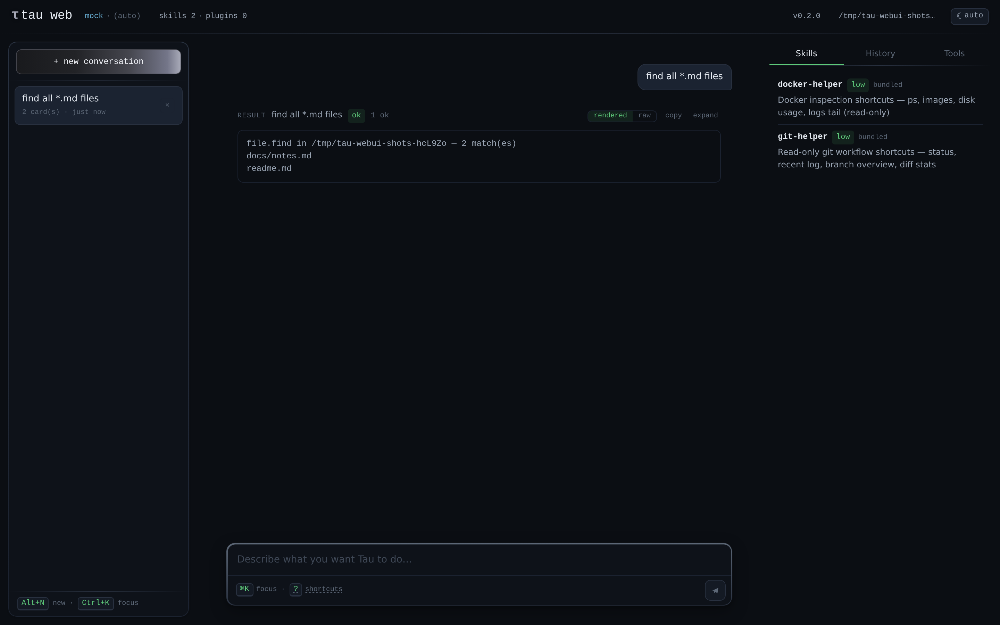
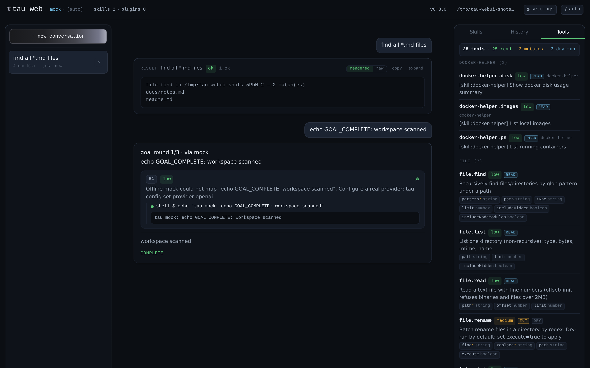

# Tau

**AI 驱动的统一终端助手 —— 自然语言进，安全命令出。**

[](https://github.com/Z-Yun-H/Tau/actions/workflows/ci.yml)
[](package.json)
[](tsconfig.json)
[](vitest.config.ts)
[](pnpm-workspace.yaml)
[](LICENSE)

Tau 把自然语言意图（中文/英文）变成**经过审查、确认后执行的计划**。它用一个
命令统一了日常终端工作 —— 文件、系统、网络、文本 —— 并让每个 AI 提议的动作
都必须先通过确定性的安全门，才能碰你的机器。

```bash
tau ask "找出所有 TODO 的地方"          # 意图 -> 计划 -> 确认 -> 完成
tau ask "how much disk is left?" --yes  # 仅自动批准低风险（中风险需 allowMediumAutoApprove 配置）
tau goal "迁移配置文件格式"             # 多轮 Agent 循环：计划 -> 执行 -> 反思 -> 循环
tau file find "*.ts"                    # 也可以直接用工具
```

---

## 为什么是 Tau

大多数 AI 终端工具选择"相信模型，然后祈祷"。Tau 反其道而行：
**AI 只负责提议，确定性代码负责裁决。**

- **要计划，不要感觉** —— 模型必须输出严格 JSON（zod 校验），垃圾输出根本到不了 shell。
- **AI 永远不给自己打分** —— 一个经过完整测试的确定性 SafetyReviewer
  （黑名单 + 风险分级 + 步数上限）横亘在每个计划和执行之间。
- **默认 dry-run** —— 所有会改数据的操作（`file.rename`、`text.replace`）先预览，
  真正生效永远需要显式参数。
- **没有删除原语** —— Tau 的一方工具不能删除；危险 shell 命令要么被黑名单拦截，
  要么经过交互确认，否则不执行。
- **离线优先** —— 没有任何 API key 时，`tau` 依然是完整的工具箱（内置 `mock` Provider）。

## 功能总览

| 命令族         | 能力                                                                                                                                                         |
| -------------- | ------------------------------------------------------------------------------------------------------------------------------------------------------------ |
| `tau ask`      | 自然语言 → Provider 计划 → 安全审查 → 确认 UI → 执行 → 历史（v0.5.0：WebUI 规划时实时展示 AI 思考）                                                          |
| `tau goal`     | 多轮 Agent 循环：计划 → 执行 → 反思 → 循环（轮数上限、每轮安全审查、确认门完全一致）                                                                         |
| `tau file`     | glob 查找（自动跳过 node_modules）、目录树、stat、行号读取（offset/limit）、单目录清单、正则批量重命名（默认 dry-run）、文本写入（工作区收容，默认 dry-run） |
| `tau sys`      | 系统/CPU/内存信息、磁盘用量、CPU 排行进程、日期时间（本地/ISO/epoch/时区）、which、环境变量查询（单名，medium 风险）                                         |
| `tau net`      | TCP 端口检测、ping、防 SSRF 的 fetch、本机 IP                                                                                                                |
| `tau text`     | 正则搜索、全项目替换（默认 dry-run）、行/词统计、sha256/sha1 哈希                                                                                            |
| `tau skill`    | SKILL.md 命令包：list/show/new/validate                                                                                                                      |
| `tau plugin`   | MCP 工具服务器接入：dsh、VS Code、文件系统……（list/add/remove/tools）                                                                                        |
| `tau history`  | 所有执行都有记录：查看、重放、清空                                                                                                                           |
| `tau alias`    | 持久化命令别名（`tau ll` → 任何命令）                                                                                                                        |
| `tau provider` | API key 管理 + 在线模型发现：配好 key 自动刷新模型列表，交互式选型                                                                                           |
| `tau config`   | Provider、超时、风险策略 —— 存在 `$TAU_HOME` 下                                                                                                              |

## 安装

```bash
git clone https://github.com/Z-Yun-H/Tau.git
cd tau && pnpm install && pnpm build
cd app/cli && pnpm link --global   # 提供 `tau` 命令（若 pnpm 全局 bin 目录不在 PATH，先执行一次 `pnpm setup`）
```

需要 Node.js ≥ 20 与 pnpm ≥ 10（corepack 可自动管理：`corepack enable pnpm`）。

## 运行截图

全部来自真实运行——CLI/TUI 为 pty 捕获渲染的 SVG，WebUI 为真实服务端 + 客户端在无头 Chromium 中的截图（全部离线、mock provider）。再生成方式见 `app/*/docs/screenshots/README.md`。

<p align="center">
  
  
</p>

<p align="center">
  
  
  
</p>

## 快速上手

```bash
# 1. 开箱即用（mock provider，完全离线）
tau ask "查找所有 ts 文件"

# 2. 接入真实模型 —— 配好 key 即解锁在线模型目录
tau provider set-key deepseek sk-...     # 存 key（写入配置，chmod 600）
                                         # -> 模型列表自动刷新
tau provider use deepseek                # 从刷新后的列表中选型
tau provider models deepseek             # 或者先浏览一遍

# 偏好环境变量？依旧支持（作为回退）：
tau config set provider openai           # + export OPENAI_API_KEY=...
tau config set provider ollama           # 本地模型，无需 key
tau config set provider zai              # 可选 z-ai-web-dev-sdk

# 3. 日常工具
tau sys info
tau net port 3000 --host localhost
tau text search "TODO" --glob "*.ts"
tau file rename " IMG_([0-9]+)" " -photo-$1"     # 先预览
tau file rename " IMG_([0-9]+)" " -photo-$1" -e  # 确认后执行
```

**PowerShell 用户**：计划中的 shell 步骤经由你的 shell 执行 ——
`tau config set shell pwsh` 强制使用显式的无 profile、非交互 PowerShell 调用，
并正确传播退出码（也支持 `bash`；默认 `auto` 在 Windows 上自动探测 PATH 中的
pwsh，POSIX 行为保持不变）。

## 安全模型 30 秒版

```
意图 ──► provider.plan() ──► validatePlanResponse() ──► reviewPlan() ──┬─► deny   （exit 2，什么都没跑）
                                    严格 JSON             │           ├─► review（高风险：强制交互确认，
                                    zod 校验             黑名单       │        --yes 也绝不自动执行）
                                                                       └─► allow （低风险：直接跑 / --yes）
```

- **黑名单**：`sudo`、`rm -rf /`、`curl | sh`、`dd of=/dev/*`、fork 炸弹、
  force-push、`DROP TABLE`…… 计划在确认之前就被拒绝。
- ** caution 名单**：`rm`、`chmod`、`kill`、`git reset --hard`、PowerShell 破坏性
  操作（`Remove-Item -Recurse`、`Format-Volume`、`Set-ExecutionPolicy`、
  `Invoke-Expression`）…… 高风险，必须交互确认。
- **`--yes` 是诚实的**：它只自动批准低风险（配置 `allowMediumAutoApprove true`
  后含中风险）—— 永不碰高风险与 blocked。
- 完整策略与设计动机：[docs/safety.md](docs/safety.md)。

## AI Provider

| Provider       | 依赖                    | 配置                                                                                                                                                        |
| -------------- | ----------------------- | ----------------------------------------------------------------------------------------------------------------------------------------------------------- |
| `mock`（默认） | 无                      | 离线可用，关键词匹配的演示计划                                                                                                                              |
| `ollama`       | 本地 ollama             | `ollama serve`，模型见 `providers.ollama.model`（`providers.ollama.think: true` 可向支持的模型请求思考）                                                    |
| `openai`       | `OPENAI_API_KEY`        | 任意 OpenAI 兼容端点：`providers.openai.baseUrl` —— 流式规划感知 `reasoning_content`（经 OpenAI 端点暴露思考的 DeepSeek-R1/GLM 等）                         |
| `deepseek`     | `DEEPSEEK_API_KEY`      | DeepSeek Harness 适配器（`@deepseek-ai/dsh-llm`）：官方流式 wire 协议、`LlmAdapter` + `StreamChunk` 流协议；model/baseUrl/timeoutMs 见 `providers.deepseek` |
| `zai`          | 可选 `z-ai-web-dev-sdk` | 未安装时优雅提示 unavailable + 修复方法                                                                                                                     |
| `anthropic`    | `ANTHROPIC_API_KEY`     | Claude Messages API：流式、`/v1/models` 发现、经 `providers.anthropic.thinking` 开启扩展思考（可选 `thinkingBudget`）                                       |
| `gemini`       | `GOOGLE_API_KEY`        | Google Gemini REST：JSON 模式（`responseMimeType`），2.5 系 thought 增量即思考，可选 `providers.gemini.thinkingBudget`                                      |

所有真实 provider 均支持流式（`planStream`）：思考增量与计划文本分离送达、
在 WebUI 中实时呈现，`validatePlanResponse` 门禁依旧权威。选择优先级：
`--provider` 参数 > `TAU_PROVIDER` 环境变量 > `config.provider`。
未知值 → 安全回落到 `mock`。

API key 解析顺序为 **配置文件（`providers.<name>.apiKey`）→ 环境变量**：
`tau provider set-key` 写入的 key 优先于为其他工具导出的同名环境变量，
CI 场景也可以继续只用环境变量。

### 模型选型：配置 key 后自动刷新目录

各 Provider 内置在线模型发现（openai/deepseek 走 `GET /models`，ollama 走
`/api/tags`）。一旦配置了 key，Tau 会立即拉取模型目录并缓存
（`providers.<name>.availableModels`，24 小时 TTL），选型始终基于真实可用的模型：

```bash
tau provider list                        # key 来源、当前模型、缓存年龄
tau provider set-key deepseek sk-...     # 存 key -> 自动刷新目录
tau provider models [--refresh|--offline]
tau provider use deepseek [model]        # TTY 下方向键交互选型
```

Tau **不内置任何默认模型** —— 模型永远来自这份实时目录或你的显式配置。当目录中
只有一个模型时，Tau 自动选中并持久化；有多个时，`tau ask` 会快速失败并给出
可操作的提示（而不是瞎猜），用 `tau provider use` 选一个即可。

目录展示永不泄漏 key；刷新失败自动降级到缓存列表；
不支持发现端点的 Provider（zai）需要显式设置 `providers.<name>.model`。

## Skills：一个 markdown 文件教会 Tau 新本事

把 `SKILL.md` 放进 `~/.tau/skills/<name>/` 或项目的 `skills/` 目录：

```markdown
---
name: git-helper
version: 0.1.0
description: 只读的 git 工作流快捷方式
risk: low
triggers: [git, commit, branch]
commands:
  - name: status
    description: 查看工作区状态
    command: git status --short --branch
---

使用文档 —— 人和 AI 规划器都会读这段。
```

```bash
tau skill list                 # bundled + user + workspace 三个作用域
tau skill new my-skill "..."   # 从模板生成到 ~/.tau/skills
tau skill validate my-skill    # frontmatter + 黑名单扫描
tau git-helper status          # 声明式命令自动成为 CLI + AI 可调用工具
```

内置示例：[`packages/skills/bundled/git-helper`](packages/skills/bundled/git-helper/SKILL.md)、
[`packages/skills/bundled/docker-helper`](packages/skills/bundled/docker-helper/SKILL.md)。
编写指南：[docs/skills-authoring.md](docs/skills-authoring.md)。

## Plugins：通过 MCP 驱动外部工具

Skills 给 Tau 加**命令**；**Plugins 给 Tau 接**[模型上下文协议
](https://modelcontextprotocol.io)（MCP）**工具服务器**。任何 MCP 服务器 ——
[DeepSeek Harness（`dsh`）](https://github.com/deepseek-ai/deepseek-harness)、
VS Code 桥接器、文件系统/GitHub/数据库服务器 —— 都能以与内置工具完全相同的
计划 → 审查 → 确认流水线接入：

```bash
tau plugin add files -- npx -y @modelcontextprotocol/server-filesystem ./project
tau plugin add dsh --url http://127.0.0.1:8787/mcp     # http 传输
tau plugin list                                        # 已配置哪些
tau plugin tools files                                 # 连接检查 + 工具发现

# 工具以 plugin.files.list_directory [risk:medium] 进入 AI 目录
tau ask "在项目里找所有超过 1MB 的文件"
```

插件工具**永远是中风险**（强制交互确认；`--yes` 尊重 `allowMediumAutoApprove`）
—— 第三方能力绝不走快速通道。传输方式：`stdio`（本地进程）与 `http`
（Streamable HTTP 端点）。指南与食谱（dsh / VS Code 接入、安全模型）：
[docs/plugins.md](docs/plugins.md)。

## 为 AI 协作而生

Tau 从设计上就是"给人用、给 AI 维护"的双端项目：

- **[`AGENTS.md`](AGENTS.md)** —— 60 秒项目认知 + 黄金法则 + 提交前门禁
- **[`AGENTS/`](AGENTS/)** —— 分子系统规则书：[架构](AGENTS/architecture.md)、
  [规范](AGENTS/conventions.md)、[测试](AGENTS/testing.md)、
  [技能](AGENTS/skills.md)、[插件](AGENTS/plugins.md)、
  [AI 集成](AGENTS/ai-integration.md)、[发布](AGENTS/release.md)
- **[`.claude/skills/`](.claude/skills)** —— 根级开发工作流技能（tau-dev / tau-build / tau-test / tau-release，及 tau-skill-new / tau-tool-new 路由），由根级 [`SKILL.md`](SKILL.md) 按工具路由；包/应用级工具技能位于 `packages/<pkg>/SKILL.md` 与 `app/<app>/SKILL.md`（如 [`packages/skills/SKILL.md`](packages/skills/SKILL.md)、[`packages/tools/SKILL.md`](packages/tools/SKILL.md)、[`app/webui/SKILL.md`](app/webui/SKILL.md)）
- **`CLAUDE.md`** 指针文件供 Claude Code 自动发现；安全模块完全确定性且有 1:1 测试覆盖
- 274 个测试、严格 TypeScript，`pnpm lint && pnpm typecheck && pnpm test` 就是 agent 门禁

## 项目结构 —— pnpm monorepo

UI 应用在 `app/`，可复用引擎在 `packages/`。每个工作区包独立声明依赖、
用 tsdown 构建、通过 `workspace:*` 互相引用；CLI（`@tau/cli`）不打包兄弟包，
运行时由工作区解析。每个包与应用都带有自己的 `README.md`，说明其公开
API、依赖与开发命令。

```
app/
  cli/            @tau/cli    —— bin `tau`：commander 应用 + `tau tui` / `tau web` 桥接
  tui/            @tau/tui    —— bin `tau-tui`：交互式 REPL（markdown 与图片预览：/md、/view）
  webui/          @tau/webui  —— bin `tau-web`：本地 Web 界面（Vue 3 + UnoCSS 客户端，亮暗双主题 + 只读设置面板，零依赖 node API）
packages/
  core/           @tau/core    —— 领域类型、配置存储、历史、TAU_HOME 路径
  tools/          @tau/tools   —— 注册表 + file/sys/net/text 工具
  engine/         @tau/engine  —— 安全审查、执行器、runPlan（唯一执行通道）
  ai/             @tau/ai      —— Provider（mock/ollama/openai/deepseek/zai）、prompt、模型目录
  skills/         @tau/skills  —— SKILL.md 校验/加载/管理 + 内置技能与模板
  plugins/        @tau/plugins —— MCP 插件系统
  agent/          @tau/agent   —— 所有 UI 共用的编排层（目录组装 + 意图→计划）
  ui/             @tau/ui      —— 主题、确认、列表选择（终端原语）
AGENTS/           agent 规则书                 docs/  深度文档
SKILL.md          根级开发工具技能路由         changelog/  每日 AI 工作日志
```

依赖方向（由包边界强制）：`core ← tools ← engine`，`core+engine+ui ← skills`，
`core+tools ← ai|plugins`，全部汇入 `agent`，应用依赖所有包。无循环——测试期也一样。

## 文档

- **[文档站](docs-site/)** —— 双语 VitePress 站点（默认中文，英文在 `/en/`），每个功能一篇；`pnpm docs:dev` 本地浏览，`pnpm docs:build` 构建
- [架构详解](docs/architecture.md) —— 流水线图、不变量、如何添加工具/Provider
- [安全模型](docs/safety.md) —— 黑白名单、风险语义、为什么没有删除工具
- [技能编写](docs/skills-authoring.md) —— frontmatter 契约、示例、校验规则
- [MCP 插件](docs/plugins.md) —— 接入 dsh / VS Code / 任意 MCP 服务器，安全模型
- [English README](README.md)

## 参与贡献

欢迎 PR —— 从 [CONTRIBUTING.md](CONTRIBUTING.md) 和 [AGENTS.md](AGENTS.md) 开始。
提交前门禁：`pnpm lint && pnpm typecheck && pnpm test:cov`。

## 许可证

[MIT](LICENSE) © 2026 Z-Yun-H
