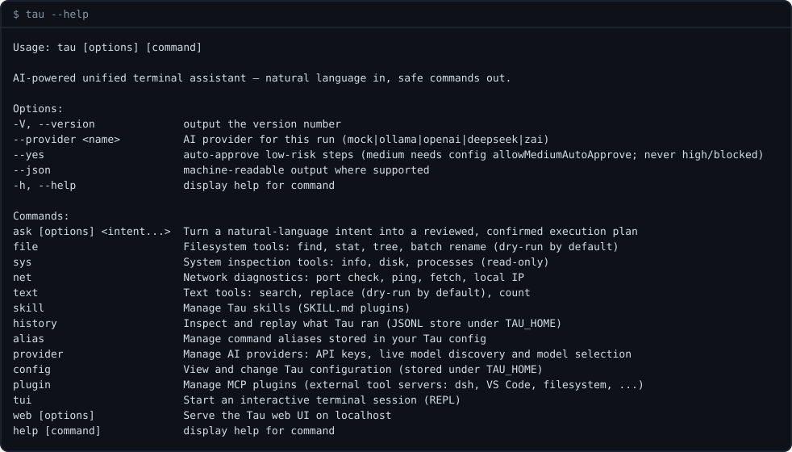
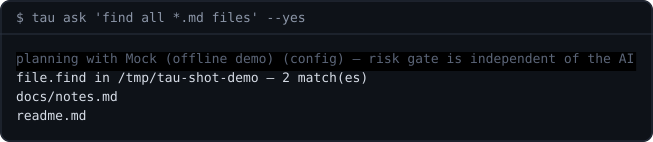

# @tau/cli

The `tau` binary — the commander-based terminal app and the primary front
door to the engine. Natural language in, safe commands out: every AI-proposed
plan goes through review → confirm → `runPlan()` before anything executes.

## Screenshots

Real runs, captured through a pty and rendered to SVG (regeneration:
[docs/screenshots/README.md](./docs/screenshots/README.md)):

**`tau --help` — the command map**



**`tau ask "find all *.md files" --yes` — natural language in, gated plan out**



## Commands

| Family                                 | What it does                                               |
| -------------------------------------- | ---------------------------------------------------------- |
| `tau ask <intent>`                     | turn natural language into a reviewed plan and run it      |
| `tau file / sys / net / text`          | direct access to the built-in tool families                |
| `tau provider list/set-key/models/use` | provider + API-key + model-catalog management              |
| `tau skill list/show/new/validate`     | skill management (bundled/user/workspace)                  |
| `tau plugin add/remove/...`            | MCP plugin management                                      |
| `tau config / history / alias`         | config store, JSONL history, command aliases               |
| `tau tui` / `tau web`                  | hand off to the interactive UIs (`@tau/tui`, `@tau/webui`) |

Global flags: `--provider`, `--yes`, `--json`.

## Layout

- `src/index.ts` — bin entry: builds the commander program, registers tools +
  skills + every command family; also exports `main()` and `buildProgram()`
  for in-process testing
- `src/<family>.ts` — one thin wiring module per command family

Command modules are wiring only: they resolve the provider/catalog via
`@tau/agent` and never execute plans themselves — that is `@tau/engine`
territory.

## Dependencies

- Runtime: `commander`
- Workspace: all `@tau/*` packages

## Development

```bash
pnpm dev -- file find "*.ts"       # run this app from source
pnpm --filter @tau/cli build       # build only this app
pnpm test
```

From the repo root, `pnpm build && pnpm --filter @tau/cli link` provides the
global `tau` binary. Root [README](../../README.md) has the user-facing docs.
