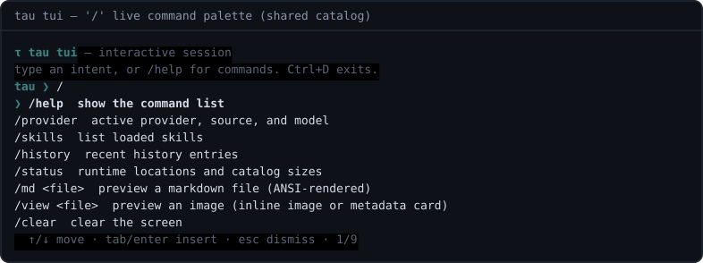

# @tau/tui

`tau-tui` — the interactive terminal session. A readline REPL that keeps a
running session with slash commands while every intent still goes through the
same plan → review → confirm → `runPlan()` pipeline as `tau ask`. Refuses to
start when stdin is not a TTY (use `tau ask` in scripts instead).

## Screenshots

Real pty sessions driven with scripted keystrokes, rendered to SVG
(regeneration: [docs/screenshots/README.md](./docs/screenshots/README.md)):

**plan → confirm → run — the safety loop inside the session**


**`/md` — markdown through the `@tau/markdown` ANSI renderer (tables, code, CJK)**


**`/` — the live command palette (v0.6.0): opens over the shared slash
catalog, narrows as you type, ↓ to navigate, enter to run**



More: `overview.svg` (command surface), `image-view.svg` (inline image /
metadata-card fallback), `slash-palette-filter.svg` / `slash-palette-select.svg`
(palette filter + keyboard navigation).

## Slash commands

| Command                                   | Effect                                                                                                       |
| ----------------------------------------- | ------------------------------------------------------------------------------------------------------------ |
| `/help`                                   | command overview (generated from the catalog)                                                                |
| `/provider`                               | show the active provider, source, model, thinking                                                            |
| `/model [id]`                             | pick the provider's model from its catalog (or set one directly); degrades to a listing outside TTY sessions |
| `/thinking [on\|off] [low\|medium\|high]` | show or set thinking mode and effort — only what the provider supports is accepted                           |
| `/skills`                                 | list loaded skills                                                                                           |
| `/history`                                | recent executed plans                                                                                        |
| `/status`                                 | session summary (home, provider, catalogs)                                                                   |
| `/md <file>`                              | preview a markdown file (ANSI-rendered)                                                                      |
| `/view <file>`                            | preview an image (inline image or metadata card)                                                             |
| `/clear`                                  | clear the screen                                                                                             |
| `/exit`                                   | leave the session (alias `/quit`, or Ctrl+D)                                                                 |

### The `/` suggestion palette

Typing `/` on an empty line opens a filterable command palette right below
the prompt: keep typing to narrow the list, `↑`/`↓` (or `Ctrl+P`/`Ctrl+N`)
to move, `Tab`/`Enter` to insert the command, `Esc`/`Ctrl+C` to dismiss.
Backspacing past the `/` closes the palette and returns to the empty prompt.
The palette shares one command catalog with dispatch and `/help` — the
listing can never drift from what actually runs. Outside the palette,
`Tab` still completes command names inline (readline's native completer).

Intents show a live planning spinner, and the plan explanation renders as
markdown through the same `@tau/markdown` ANSI renderer.

Anything that is not a slash command is treated as an intent: it is planned
by the resolved provider, reviewed by the safety gate, and executed only
after confirmation (or `autoApproveAll` when the session was started in
auto-approve mode — same semantics as `tau ask --yes`).

## Public API

- `startTui()` — the REPL entry (bin `tau-tui`; wired into the CLI lazily via dynamic import)

## Dependencies

- Runtime: none
- Workspace: `@tau/agent`, `@tau/engine`, `@tau/markdown`, `@tau/ui`, `@tau/core`

## Development

```bash
pnpm dev:tui                        # run from source (tsx, dev condition)
pnpm --filter @tau/tui dev          # vite build --watch (dev loop)
pnpm --filter @tau/tui build        # vite build (node/SSR mode, dist/index.js)
```

Build: vite in node/SSR mode (see `vite.config.ts`) — workspace `@tau/*`
siblings stay external and the `#!/usr/bin/env node` shebang is re-added to
`dist/index.js` so the `bin` stays executable.

No new execution channels: the TUI is a front door, the engine is the door.
