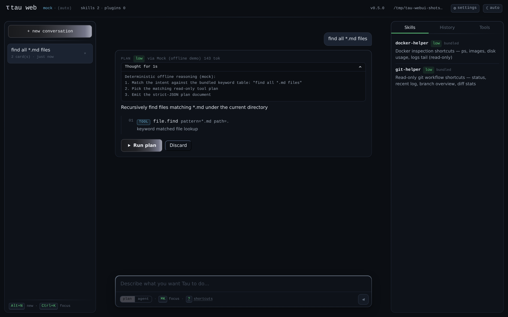
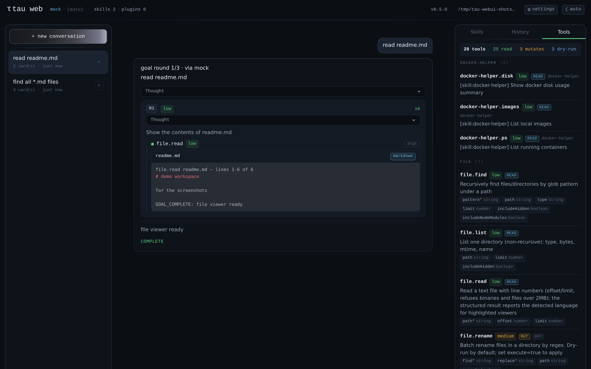
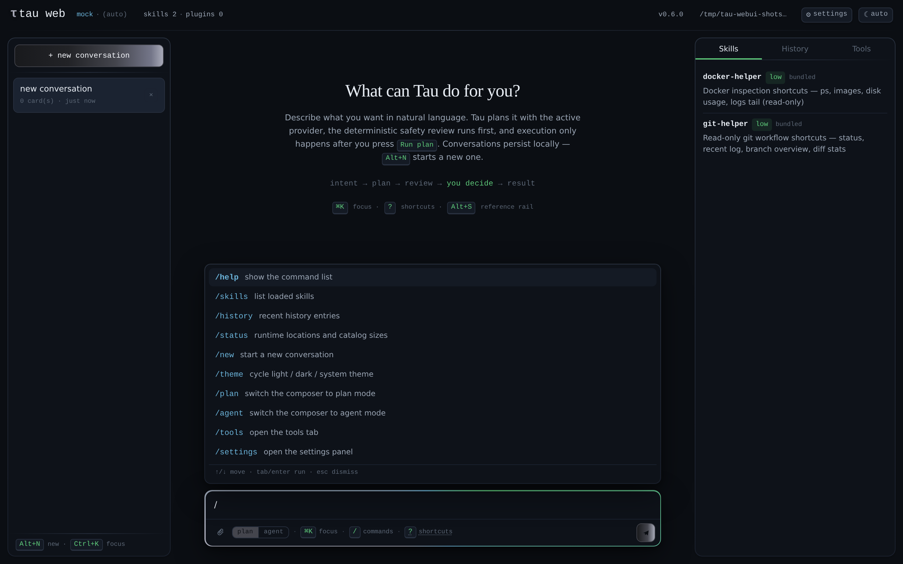
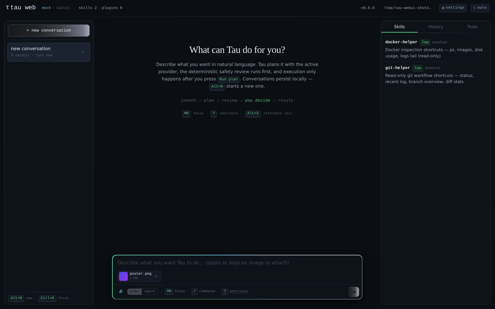
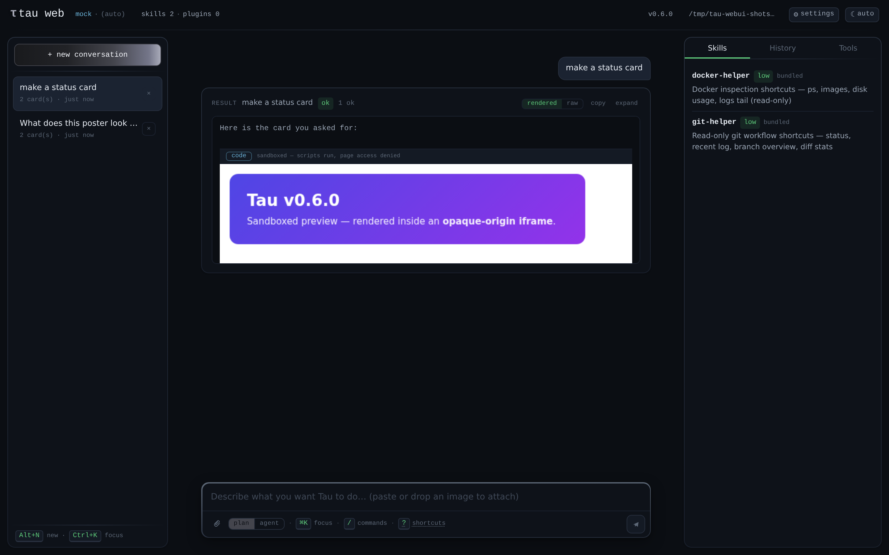
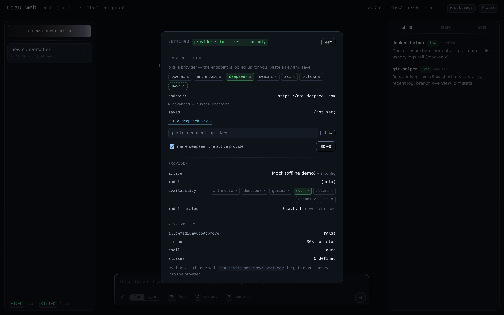
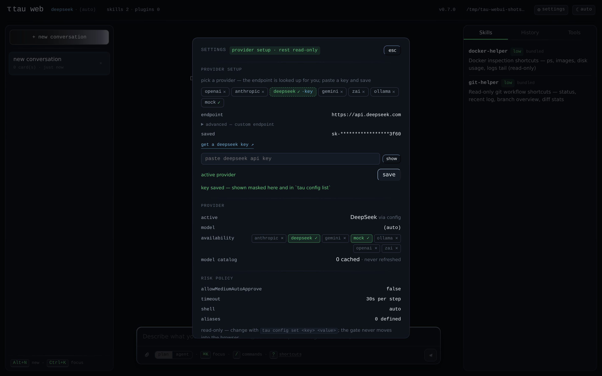
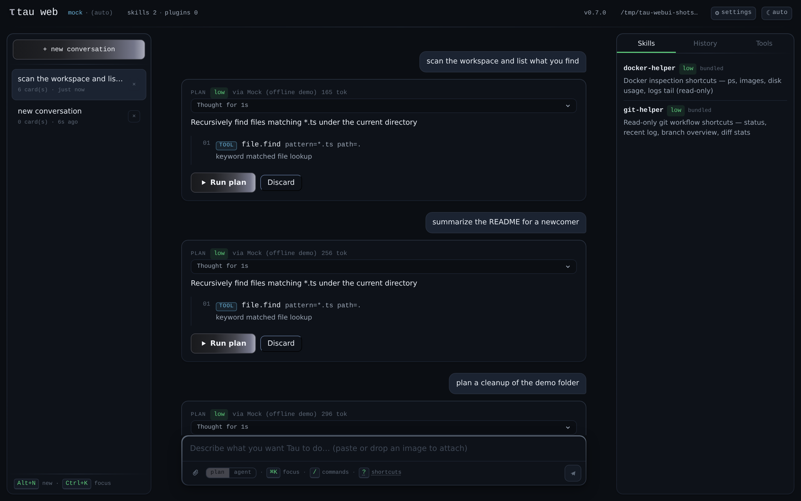
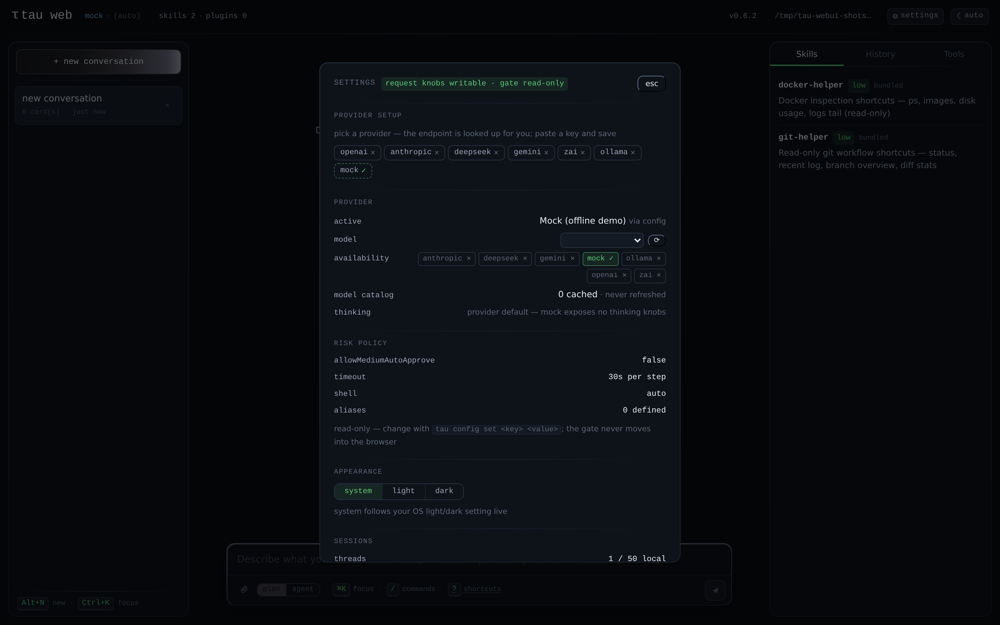
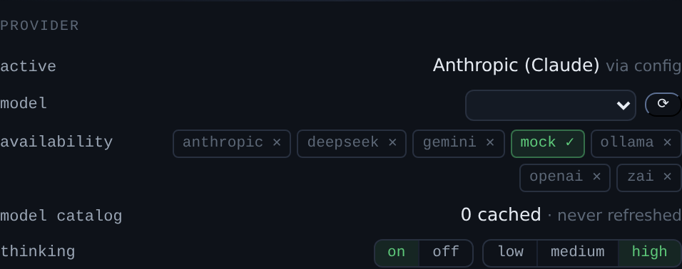

# @tau/webui

`tau-web` — the local web interface. A node HTTP API (`src/server.ts`,
zero-dependency `node:http`) plus a **Vue 3 + UnoCSS** client (`client/`,
built by vite). Both front doors — TUI and Web — drive the same
plan → review → confirm → `runPlan()` pipeline through `@tau/agent`.
Binds to 127.0.0.1; deny verdicts are refused server-side and high-risk
plans demand the explicit `confirmHighRisk` flag.

The visual language takes pixel-level reference from
[chat.z.ai](https://chat.z.ai/) — quiet restraint, fused sidebar, beam
composer, chrome-only accent, two-font system — adapted to Tau's
domain (plans, steps, tools, the deterministic risk model). The full
spec is [`DESIGN.md`](./DESIGN.md); the checklist is
[`SKILL.md`](./SKILL.md).

## Screenshots

Real end-to-end sessions: the actual server + client in headless
Chromium with the offline mock provider (regeneration:
[docs/screenshots/README.md](./docs/screenshots/README.md)):

**the reviewed plan — risk badge, steps, Run plan / Discard**


**the thinking panel, expanded — provider reasoning one click away (v0.5.0)**



**the streaming result — NDJSON events rendered live**


**agent mode (v0.4.0) — multi-round goal card: live steps, per-round
approval gates, final answer**


**agent mode file viewer (v0.5.0) — a `file.read` round renders as a
structured tool call card with the shiki-highlighted file, path + language
chip, and the per-round thinking panel**



**`/` command menu (v0.6.0) — the shared slash catalog, one keystroke away;
narrows as you type, keyboard-first**



**image attachments (v0.6.0) — pick, paste, or drop; chips preview in the
composer (magic-number-gated) and travel with the sent message**



**sandboxed HTML preview (v0.6.0) — a generated ```html block renders
inside an opaque-origin iframe (scripts run, page access denied); native
viewers for generated PDF/image files stream through `GET /api/file`**



**provider setup (v0.6.1) — pick a provider, the endpoint is looked up
from the server catalog, the key console is one link away; paste only
the key and save**



**privacy masking (v0.6.1) — the key input is a password field; an
explicit peek re-masks itself after 8s, and saved keys render only as
the server's `sk-***last4` mask**



**viewport lock (v0.6.1) — the page is exactly one viewport tall at
every breakpoint: a long thread scrolls inside the stream column while
the composer stays pinned**



**model & thinking selection (v0.6.2) — the settings provider section
becomes selectable: a catalog-backed model dropdown with refresh, and
thinking mode/effort pickers rendered straight from the server's
capability table (knob-less providers get an honest note)**





More: `command-menu-filter.png` (typed filter), `attachments-sent.png`
(chips on the sent card + plan review), `image-view.png` /
`image-viewer-card.png` (native image view), `provider-setup-key.png`
(masked paste) / `provider-setup-reveal.png` (explicit peek) /
`provider-setup-card.png` (the setup section, element-cropped),
`thinking-controls-mock.png` (the honest knob-less note).

## Observability (v0.4.0)

The server logs **one line per request** to stderr — `ts · method · path →
status · ms` with a `tokens=TOTAL(P/C)` note on AI-calling routes
(`/api/plan`, goal rounds) when the provider reports usage. `TAU_WEBUI_QUIET=1`
silences the default sink; programmatic starts can inject their own via
`startWebUi({ log })` / `createRequestListener({ log })` (injection always
wins over the env switch). `POST /api/plan` responses carry an additive
`usage` field, and goal streams annotate each `round_end` with that round's
AI cost — usage the wire always reported but Tau used to drop silently.

## Client stack

- **Vue 3** — a slim shell (`client/App.vue`) over the component
  inventory in `client/components/` (StatusHeader with chrome `τ` brand
  mark, SessionSidebar with fused history rail + `+ new conversation`
  chrome primary, ShortcutsModal, PlanCard/StepRow with chrome `Run
plan`, ResultCard, ErrorCard, SidePanel with Skills/History/Tools,
  Composer with the beam + chrome Send, RiskBadge, EmptyState with
  serif headline); state lives in `client/composables/` (module
  singletons, no state library), HTTP in `client/lib/api.ts`, markdown
  via `@tau/markdown`
- **Agent mode** — the stream is a conversation: user bubbles +
  assistant turns (plan card, then result card in the same turn);
  threads persist to `localStorage` (server history stays the durable
  record); keyboard-first (Enter send / Shift+Enter newline / Ctrl+K
  focus / `?` shortcuts panel / Alt+N new thread / Alt+S rail toggle /
  Alt+T theme cycle / Ctrl+⌘+, settings / Esc closes modal + drawer); markdown preview with
  rendered/raw toggle, copy and expand — rendered by the zero-dependency,
  escape-first `@tau/markdown`, never a sanitizer gap
- **Generated-content previews** (issue #136) — `html` fenced blocks in
  results/goal answers get a `preview` toggle rendering in an opaque-origin
  sandboxed iframe (`allow-scripts` only); `file.read` of PDFs and images
  streams through the read-only, workspace-contained `GET /api/file` into
  the browser's native viewer instead of binary-as-text; the escape-first
  markdown pipeline is untouched
- **Image attachments** (issue #135) — paperclip button, clipboard paste
  and drag-and-drop all feed one validated draft list in the Composer;
  drafts render as removable chips with data-URL previews (PNG/JPEG/WebP/
  GIF, up to 4, max 4 MB each — the server re-validates with its own
  whitelist + magic-number probe). Sending images with no text uses an
  explicit default intent. Payloads ride the plan/goal request only;
  user cards keep name/type/size meta (thumbnails are session-only), and
  text-only providers get an honest "image dropped" annotation instead
  of pretending to see pixels
- **Light & dark themes** — three-state preference (`light`/`dark`/
  `system`, default follows the OS) cycled from the header button or
  `Alt+T`, persisted in `tau-webui-theme-v1`, resolved before first
  paint (no wrong-theme flash); both ramps ship as `--tau-*` CSS vars
  with per-theme risk-color tuning (AA) and per-theme elevation shadows
- **Settings panel** — `Ctrl/⌘+,` (or the header `⚙ settings` button)
  opens a read-only view of the effective config: active provider +
  per-provider availability chips + model-catalog cache state, risk
  policy (with a `tau config set` hint — the browser never writes
  config), the theme picker, and local session stats. Served by the
  additive `GET /api/config` (keys masked `sk-***last4`, same redaction
  as `tau config list`); server tests pin the no-plaintext guarantee
- **UnoCSS** (`uno.config.ts`, `presetWind3`) — maps every `tau.*` color
  to the `--tau-*` CSS variables in `client/theme.css` (the single
  source, shipping BOTH the dark default and light ramps) plus the risk
  palette as THE semantic system (`-soft`/`-edge` two-step tokens) and
  the chrome sweep; typography and motion tokens in `client/theme.css`
- **Design system**: "terminal precision" with a chat.z.ai-inspired
  quiet — data in mono, prose in sans, serif for the empty-state
  headline only; layered surfaces (`.tau-surface*` elevation + gradient
  edges + `.tau-divider` separators — no bare 1px hairlines on flat
  fills); gradients restricted to the chrome sweep (brand mark + chrome
  buttons) and the structural edge/divider treatments; no glassmorphism;
  responsive (≥1024px three-column rail, below that a single flow with
  sticky composer); restrained motion with `prefers-reduced-motion`
  support. Normative spec: [DESIGN.md](./DESIGN.md); checklist:
  [SKILL.md](./SKILL.md) (`tau-webui-design`)
- **Vite** (`vite.config.ts` client build → `dist/client/`;
  `vite.server.config.ts` node/SSR build of the server → `dist/index.js`
  with the `tau-bin-shebang` plugin keeping the bin executable)

The API server statically serves `dist/client/` when built, falling
back to the raw `client/` sources (dev/tests) — API shape and the
safety gates are identical in both modes. The `tau web` commander
wiring lives in `@tau/cli` (`app/cli/src/web.ts`); this package never
imports commander.

## Public API

- `startWebUi(options)` / `createRequestListener()` — node server entry
- bin `tau-web` (also `tau web` via the CLI)

HTTP surface: `GET /api/status` (provider, model, availability,
skill/plugin counts), `GET /api/skills` (with risk/origin),
`GET /api/tools` (the tool layer inventory: name/description/risk/owner/
params — pure data, never the executables), `GET /api/history` (`?limit=`
optional, default 20, cap 500), `POST /api/plan` (intent → plan +
deterministic review), `POST /api/execute` (request-as-approval; deny
→ 403, high risk requires `confirmHighRisk`), `POST /api/execute/stream`
(NDJSON streaming execution), `POST /api/goal/stream` (agent mode: multi-round
`runGoal()` lifecycle as NDJSON — non-"allow" rounds pause on
`approval_required` until `POST /api/goal/approve` or the 10-minute TTL;
client disconnect cancels the goal).

## Dependencies

- Runtime (node side): none beyond workspace packages
- Workspace: `@tau/core`, `@tau/engine`, `@tau/ai`, `@tau/skills`,
  `@tau/agent`, `@tau/markdown`
- Client (bundled): `vue`, `@vueuse/core`, `shiki`
- Build/dev only: `vite`, `@vitejs/plugin-vue`, `unocss`, `tsx`,
  `playwright-core` (for screenshot regen)

## Development

```bash
pnpm --filter @tau/webui build      # client + server builds
pnpm --filter @tau/webui dev        # vite dev server (:5173, proxies /api → :8787)
pnpm --filter @tau/webui dev:server # engine API server on :8787 (tsx from source)
pnpm dev:web                        # same API server from the repo root
pnpm --filter @tau/webui shots      # regenerate plan/result/tools/settings/agent PNGs
```

No new execution channels: the WebUI is a front door, the engine is
the door.
